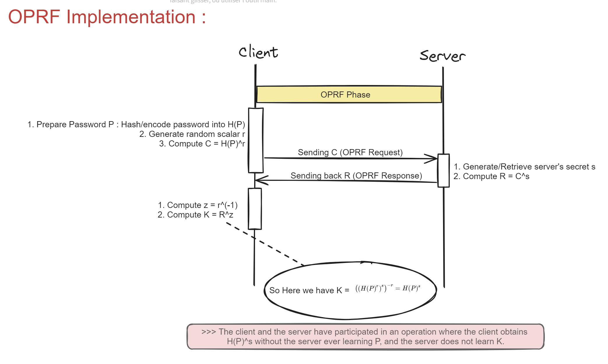
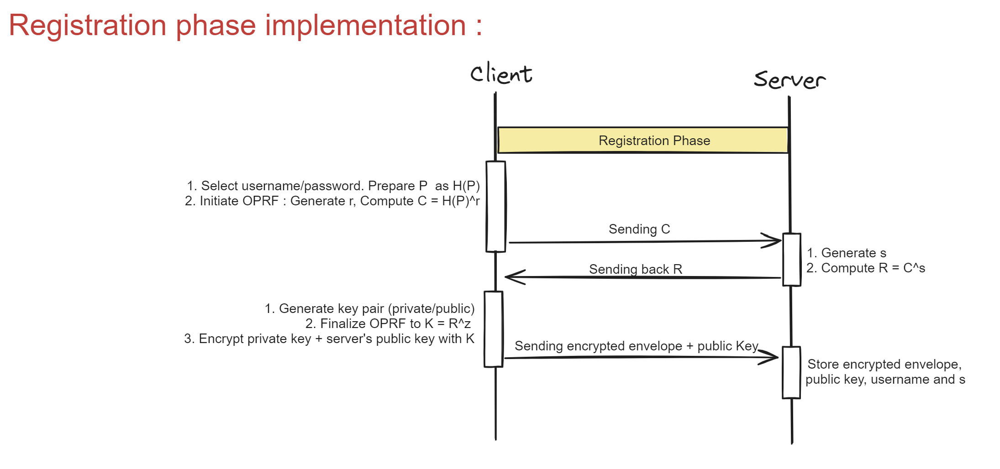
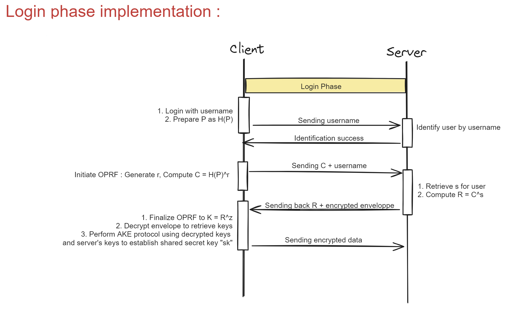

This project is done by : **Nour El Houda GALAI**, **Shaina MUMBUKU BAKILI** and **Yassine BAKRIM** , _**CCC1**_.

It implements an Oblivious Pseudo-Random Function (OPRF) protocol to securely perform password-based authentication without exposing the password or derived keys to the opposing party as a plaintext.
The implementation is splited into two phases : Registration, and Login 

# OPRF Phase :
 The OPRF protocol is an interactive protocol executed between a client and a server to compute the output of a pseudo-random function where the server learns nothing about the client's input, and the client learns only the output.
    As shown in the image below, the client initiates the protocol by preparing the password as H(P), where H is a cryptographic hash function and P is the password. The client then generates a random scalar r and computes C = H(P)^r. The value C is sent to the server as the OPRF request.
    Upon receiving C, the server retrieves its secret scalar s and computes R = C^s that will be sent back to the client as the OPRF response.
    The client after receiving R, computes z = r^(-1) and finalizes the OPRF to K = R^z. This results in K being equal to H(P)^s, the client's password hashed and exponentiated with the server's secret without the server ever learning the actual password P, and the client only learns the final output K.
    

# Registration Phase :
    In the registration phase, the client selects a username and password, preparing P as H(P) and initiating the OPRF to generate the shared secret K. And then, the client generates a key pair and encrypts the private key along with the server's public key using K.
    The client sends the encrypted envelope and their public key to the server, which stores this information along with the username and its secret s.

# Login Phase
    The login phase begins with the client logging in using their username and preparing P as H(P). The client initiates the OPRF to generate r, compute C, and sends both C and their username to the server.
    The server identifies the user by the username, retrieves the stored secret s for that user, computes R = C^s, and then sends back R along with the encrypted envelope from the registration phase.
    The client finalizes the OPRF to obtain K, decrypts the envelope to retrieve the key pair, and performs an Authenticated Key Exchange (AKE) protocol using the decrypted keys and the server's keys to establish a shared secret key, sk.

